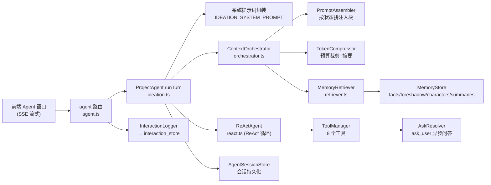
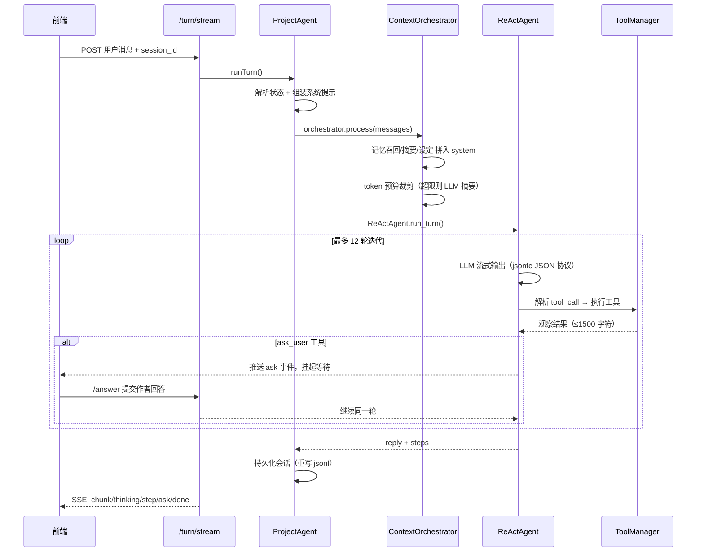

# Agent 内部逻辑分析报告

> 分析对象：统一 Agent 窗口（T3/T7）的完整链路——系统提示词、上下文编排、记忆召回、ReAct 工具循环、会话持久化。
> 分析时间：2026-08-18。

## 一、总体架构

Agent 中枢采用「**单持续对话线 + 状态驱动上下文重组**」设计：Agent 窗口是唯一对话入口，每轮对话先按小说当前**状态**（创意孵化/世界观/人物/章纲/正文/审阅/伏笔管理）动态组装上下文，再进入 ReAct 循环执行工具与回复。数据层以**单书记忆**（facts/伏笔/人物/分层摘要）为底座，检索走轻量规则召回（非向量库）。



关键文件：
- 入口路由：`backend/src/api/routes/agent.ts`
- 核心编排：`backend/src/workflow/ideation.ts`
- 上下文编排：`backend/src/agent/orchestrator.ts`
- ReAct 循环：`backend/src/agent/react.ts`

## 二、单轮对话数据流



核心入口 `runTurn`（`ideation.ts`）步骤：
1. 取项目、解析当前状态（`opts.state ?? project.status`）
2. 替换系统提示占位符 → 追加「当前创作状态」hint
3. 加载会话历史（多会话走 `AgentSessionStore`，否则兼容旧 `agent_chat.jsonl`）
4. `ContextOrchestrator.process()` 做记忆召回 + 拼接 + 压缩
5. 构建 `ReActAgent`（默认 `jsonfc` 模式），注入处理后的 messages
6. **先落盘**「历史 + 本次用户消息」→ 再跑循环（防丢消息）
7. 成功后整体重写历史（`agent.messages.slice(1)`），并写交互记录

## 三、系统提示词组装

系统提示 = `IDEATION_SYSTEM_PROMPT` 模板 + 动态注入块，最终结构：

```text
[1] IDEATION_SYSTEM_PROMPT（角色/项目信息/工作方式/工具/协议/结束条件）
    ├─ 项目信息：项目名/题材/平台/目标字数（{project_name} 等占位替换）
    ├─ 工作方式：ReAct 循环说明
    ├─ 可用工具：toolManager.toPrompt()
    ├─ 输出协议：TOOL_FORMAT_JSONFC（默认）
    └─ 多轮规则：不确定就问、done=true 语义、结束词 <<DONE>>
[2] ## 当前创作状态
    当前小说级状态：{label}（key=…），状态上下文规则：{context_assembly_ref}
[3] --- （以下由 PromptAssembler 追加）
    ## 【记忆召回（预注入）】active 伏笔 + facts
    ## 【分层摘要（long-range 记忆）】L2~L5
    ## 【设定片段：worldview / characters】JSON（各截 600 字符）
[4] ## 【历史对话摘要（旧消息已压缩）】（仅当发生裁剪时）
```

**发现的缺口（已修复）**：模板中有 `{vision_doc_guide}` 与 `{core_elements_guide}` 两个占位符，`runTurn` 原先只替换了 `project_name/genre/platform/target_words/tools/tool_format/end_token` 七个，导致系统提示里原样残留字面量、指南未生效。**已修复**：`runTurn` 现已补上 `.replace("{vision_doc_guide}", VISION_DOC_GUIDE)` 与 `.replace("{core_elements_guide}", CORE_ELEMENTS_GUIDE)`。另外 `REACT_SYSTEM_PROMPT` 定义了但全库无引用，属历史遗留。

## 四、上下文编排（PromptAssembler + TokenCompressor）

`ContextOrchestrator.process`（`orchestrator.ts`）默认配置：`include_memory=true`、`include_settings=true`、`include_summaries=true`、`memory_limit=10`、`summary_levels=[2,3,4,5]`（跳过 L1）。

**PromptAssembler** 按固定块序拼入系统消息：状态说明 → 记忆预注入 → 分层摘要 → 设定片段（仅 worldview + characters，各截 600 字符，不含 outline/style）。

**TokenCompressor**：
- 预算 = `MODEL_CONTEXT_WINDOW`（默认 32768）− `MODEL_RESERVED_OUTPUT_TOKENS`（默认 2048）
- 单条消息超 3000 token、工具观察超 1500 token 时按字符比例截断
- 仍超预算则**从旧到新丢消息**（始终保留 system，`function_call` 与其 function 结果成对保留）
- 有丢弃时调用 LLM 压缩为 3~5 条要点（作者需求/已确认决策/已完成动作/待办），注入到 `SUMMARY_HEADER` 下；压缩后仍超则再裁

## 五、记忆与召回

**单书记忆四类**（`memory_store.ts`，存于项目 `memory/` 目录）：
- `facts.jsonl`：正典事实，append-only，带 `state/source/known_by/supersedes` 标签
- `foreshadow.jsonl`：伏笔台账，埋/收/兑现（`planted/reaped/dropped`）
- `characters.json`：人物关系快照，JSON 重写
- `summaries/L1..L5.json`：分层摘要（L1 单章 → L5 全书）

**轻量 RAG 三管并用**（`retriever.ts`）：
1. **预注入**（`injectAll`）：优先取**活跃伏笔**（未兑现），不足再按当前 state 补 facts，上限 10 条
2. **Agent 主动读取**：`memory_search` 工具（`retriever.retrieve`），facts 按 `state/source/keyword`（子串 `includes` 匹配）+ 伏笔按描述包含查询，按 id 去重
3. **分层摘要兜底**：L2~L5 截 500 字符注入

`MEMORY_RETRIEVAL_MODE` 环境变量支持 `keyword|vector`，默认 `keyword`；**vector 模式只是占位**（命中后仍回退 keyword）。按 ADR-0005 的取舍，本轮不上向量库。

## 六、工具面与 ReAct 循环

**工具清单**（`ideation.ts` `_buildToolManager`）：
- `file_read` / `file_write`（限项目根目录内）
- `web_search`
- `ask_user`（支持 options/multiple/allow_custom，走 AskResolver 异步问答）
- `read_current_state` / `list_states` / `switch_state`（状态感知与自由导航）
- `memory_search`（按需召回记忆）

**ReAct 循环**（`react.ts`）：默认 `jsonfc` 模式（`response_format: json_object`），每轮必须是 `{"thought","tool_call","done"}` JSON；另支持 `native`（function calling）与 `dsml`（文本 DSL）。`max_iterations=12`、`max_output_tokens=4000`。
- `done=true` 且无工具 → 输出最终回复
- 有 `tool_call` → 执行工具，观察结果 ≤1500 字符回填
- `done=false` 且未调工具 → 追加驱动消息继续
- 协议解析失败 → 注入纠正消息重试，连续 3 次则中止
- **承诺驱动**：检测到「我去搜索/我去写…」等承诺词但没调工具 → 驱动其真正执行
- 检测到结束词 `<<DONE>>` → 立即结束

**ask_user 异步机制**：Agent 挂起时通过 SSE 推 `ask` 事件；前端用 `/answer` 提交回答 → `AskResolver.submitAnswer` 让同一轮继续。默认超时 300s（`AGENT_ASK_TIMEOUT`），断连可用 `/pending-ask` 恢复查询。路由层 `_askResolvers` 按 `project_id::session_id` 隔离，`_activeTurns` 阻止同会话并发 turn（返回 409）。

## 七、会话持久化

`AgentSessionStore`（`agent_session_store.ts`）按书多会话，存于项目 `memory/sessions/`：
- `index.json`：会话元数据（id/title/state/时间/消息数）
- `<sessionId>.jsonl`：每行一条消息 `{role, content, timestamp, function_call?, name?}`

支持列表/新建/重命名/删除/加载/保存，每轮结束**整体重写**消息文件（非 append）。旧 `agent_chat.jsonl` 自动迁移为「默认对话」会话。切换页面/重启后可从 `/sessions/:id/messages` 恢复历史。

## 八、模型分配与交互记录

- **模型选择**（`state.ts` `getClientForState`）：按当前状态查 `app-state.json` 的任务分配（状态 key → 旧任务 text/structure/check 兜底），再回退 `.env` 的模型池。每轮带独立 `InteractionLogger` 记录 LLM 调用。
- **流式健壮性**：SSE 每 15s 心跳；LLM 流式空闲看门狗 90s（`LLM_STREAM_IDLE_TIMEOUT`）防止「卡住」。
- **交互落库**：每轮结束后 `saveInteraction("agent", …)` 写入 `interaction_store`，记录 request/response/tool/耗时/token 与错误。

## 九、现有局限与改进建议

- **指南未注入（已修复）**：`{vision_doc_guide}` / `{core_elements_guide}` 占位符原先未替换，愿景文档/核心要素的结构约束没进提示词；现已在 `runTurn` 补上两个 `.replace` 注入 `VISION_DOC_GUIDE` / `CORE_ELEMENTS_GUIDE`。
- **召回偏弱**：facts 匹配是 `includes` 子串（无分词/同义），预注入最多 10 条且默认只按 state 过滤；`memory_search` 参数 `state/source` 与 keyword 是**且**关系，组合查询时命中率受限。
- **设定注入不全**：只注入 worldview + characters（各 600 字符），outline/style 未进上下文，长文档状态下信息可能不够。
- **摘要联动待完善**：分层摘要只读不写——`runTurn` 里没有触发生成 L1~L5 的逻辑（ADR 提到「状态机工作流落盘后自动触发」），当前更像是手工预留结构。
- **状态一致性**：会话元数据里的 `state` 与每轮实际使用的 `project.status` 可能不一致（路由未把 session.state 传入 `runTurn`）。
- **重写式持久化**：每轮整文件重写 jsonl，会话很长时性能一般（可用 append + 尾部截断优化）。
